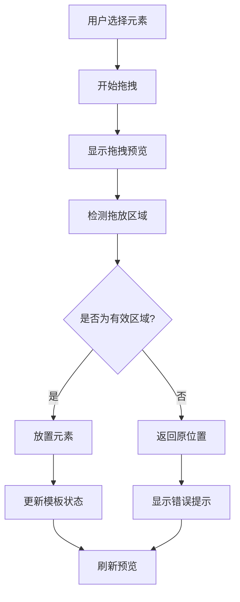
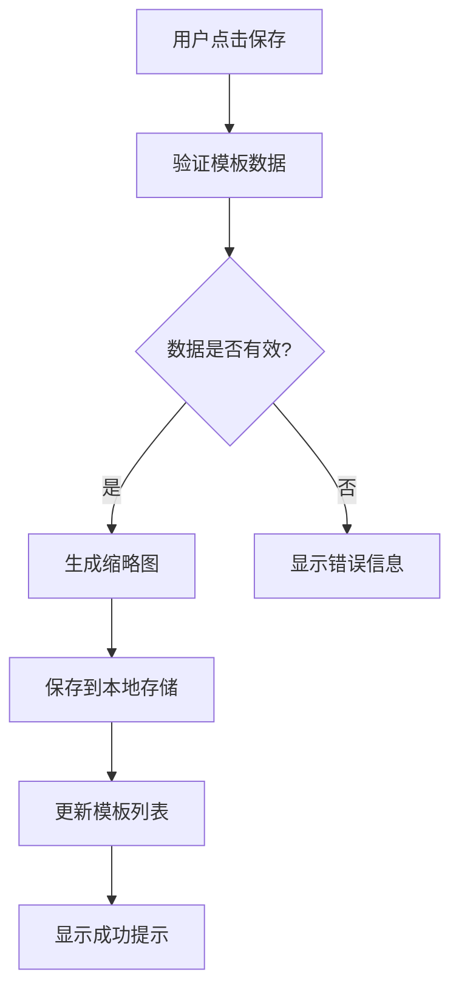

# 可视化模板编辑器架构设计

## 1. 系统架构概览

### 1.1 当前系统分析
现有系统包含：
- 基础模板选择（3个预设模板）
- 简单的文本和图片编辑
- 实时预览功能
- PNG导出功能

### 1.2 增强目标
- 可视化拖拽编辑界面
- 灵活的模板元素管理
- 丰富的配置选项
- 完整的模板管理系统

## 2. 核心功能模块设计

### 2.1 可视化编辑器模块
```
VisualEditor/
├── DragDropCanvas/          # 拖拽画布
│   ├── CanvasArea.tsx      # 主画布区域
│   ├── ElementContainer.tsx # 元素容器
│   └── DropZone.tsx        # 拖放区域
├── ElementLibrary/         # 元素库
│   ├── TextElement.tsx     # 文本元素
│   ├── ImageElement.tsx    # 图片元素
│   ├── ShapeElement.tsx    # 形状元素
│   └── LayoutElement.tsx   # 布局元素
└── ElementControls/        # 元素控制
    ├── PropertyPanel.tsx   # 属性面板
    ├── StyleEditor.tsx     # 样式编辑器
    └── PositionEditor.tsx  # 位置编辑器
```

### 2.2 模板配置模块
```
TemplateConfig/
├── LayoutConfig/           # 布局配置
│   ├── GridSystem.tsx     # 网格系统
│   ├── ColumnLayout.tsx   # 栏目布局
│   └── FlexLayout.tsx     # 弹性布局
├── StyleConfig/           # 样式配置
│   ├── ColorTheme.tsx     # 颜色主题
│   ├── FontConfig.tsx     # 字体配置
│   └── BackgroundConfig.tsx # 背景配置
└── ComponentConfig/       # 组件配置
    ├── TextBoxConfig.tsx  # 文本框配置
    ├── ImageBoxConfig.tsx # 图片框配置
    └── SpacingConfig.tsx  # 间距配置
```

### 2.3 模板管理模块
```
TemplateManager/
├── Storage/               # 存储管理
│   ├── LocalStorage.tsx  # 本地存储
│   ├── TemplateCache.tsx # 模板缓存
│   └── ImportExport.tsx  # 导入导出
├── Library/              # 模板库
│   ├── TemplateList.tsx  # 模板列表
│   ├── TemplateCard.tsx  # 模板卡片
│   └── TemplatePreview.tsx # 模板预览
└── Operations/           # 操作功能
    ├── SaveTemplate.tsx  # 保存模板
    ├── LoadTemplate.tsx  # 加载模板
    └── DeleteTemplate.tsx # 删除模板
```

## 3. 数据结构设计

### 3.1 模板元素数据结构
```typescript
interface TemplateElement {
  id: string
  type: 'text' | 'image' | 'shape' | 'layout'
  position: {
    x: number
    y: number
    width: number
    height: number
  }
  style: {
    backgroundColor?: string
    color?: string
    fontSize?: number
    fontFamily?: string
    border?: string
    borderRadius?: number
    padding?: number
    margin?: number
  }
  content: any
  zIndex: number
  locked: boolean
  visible: boolean
}
```

### 3.2 模板配置数据结构
```typescript
interface TemplateConfig {
  id: string
  name: string
  description: string
  thumbnail: string
  layout: {
    type: 'single' | 'double' | 'multi' | 'grid'
    columns: number
    rows: number
    gap: number
  }
  theme: {
    primaryColor: string
    secondaryColor: string
    backgroundColor: string
    fontFamily: string
  }
  elements: TemplateElement[]
  metadata: {
    createdAt: Date
    updatedAt: Date
    version: string
    tags: string[]
  }
}
```

### 3.3 历史记录数据结构
```typescript
interface HistoryState {
  id: string
  action: 'add' | 'delete' | 'move' | 'edit' | 'style'
  timestamp: Date
  templateState: TemplateConfig
  description: string
}
```

## 4. 用户交互流程设计

### 4.1 拖拽编辑流程


### 4.2 模板保存流程


## 5. 技术实现方案

### 5.1 拖拽功能实现
- 使用 React DnD 库实现拖拽功能
- 自定义拖拽预览组件
- 实现多选和批量操作

### 5.2 实时预览实现
- 使用 React 状态管理实现实时更新
- 优化渲染性能，避免不必要的重渲染
- 实现预览模式切换（编辑/预览）

### 5.3 撤销重做实现
- 使用命令模式实现操作历史
- 限制历史记录数量，避免内存溢出
- 实现快捷键支持（Ctrl+Z, Ctrl+Y）

### 5.4 本地存储实现
- 使用 IndexedDB 存储大量模板数据
- 实现数据压缩和版本管理
- 添加数据备份和恢复功能

## 6. 性能优化策略

### 6.1 渲染优化
- 使用 React.memo 优化组件渲染
- 实现虚拟滚动处理大量元素
- 使用 requestAnimationFrame 优化动画

### 6.2 内存优化
- 及时清理不用的事件监听器
- 实现图片懒加载和缓存
- 优化大型模板的加载策略

### 6.3 用户体验优化
- 添加加载状态和进度提示
- 实现操作反馈和错误处理
- 优化触摸设备的交互体验

## 7. 开发计划

### Phase 1: 基础架构搭建
1. 重构现有代码结构
2. 实现基础的拖拽画布
3. 创建元素库组件

### Phase 2: 核心编辑功能
1. 实现元素的添加、删除、移动
2. 开发属性编辑面板
3. 实现撤销重做功能

### Phase 3: 配置系统
1. 实现布局配置选项
2. 开发样式配置界面
3. 添加组件配置功能

### Phase 4: 模板管理
1. 实现模板保存和加载
2. 开发模板库界面
3. 添加导入导出功能

### Phase 5: 优化和完善
1. 性能优化和bug修复
2. 用户体验改进
3. 功能测试和部署